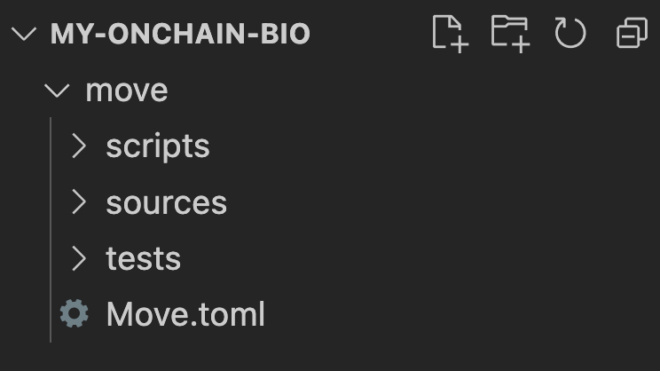
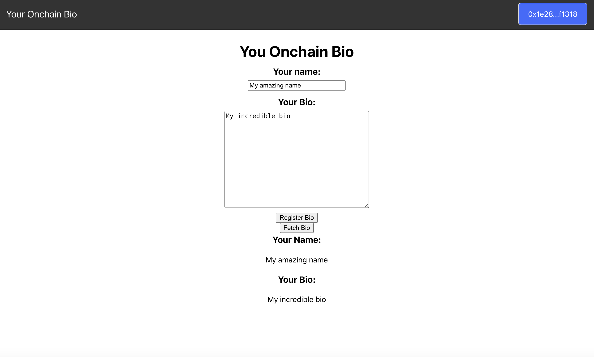

# Aptos Move dApp

In this guide, we will learn how to build an end-to-end "onchain bio" dApp. We'll start with the the Move contract. Then we'll build a React frontend and let wallets connect and register a bio.

## Requirements

Make sure to have [Aptos CLI](https://aptos.dev/tools/aptos-cli/install-cli/) installed.

View an example of the finished dApp [here](https://github.com/movementlabsxyz/onchain-bio-dapp).

## Initialize your Environment 

Initialize your Aptos profile for your package development and add Movement network testnet as a custom network.

```bash
aptos init --network custom --rest-url https://aptos.testnet.movementlabs.xyz --faucet-url https://faucet.testnet.suzuka.movementlabs.xyz/
```

## Setup 

Create a new directory and navigate into it:

```bash
mkdir my-onchain-bio && cd my-onchain-bio
```

Open a code editor so you can see your dApp's file structure. Here we'll use VS Code:

```bash
code .
```

## Creating and publishing the Onchain Bio smart contract

Now that our environment is set up, let's write some code, starting with the Move contract!

First, create a move directory and navigate into it:

```bash
mkdir move && cd move
```

Then create a move project, containing code for an onchain package:

```bash
aptos move init --name my_todo_list
```

Your file structure should now look like this:



## Creating a Move Module 

Create a new file named onchain_bio.move within the sources directory and add the following to that file:

```rust
module onchain_bio_addr::onchain_bio {
  use std::string::{String};
  use std::signer;

  struct Bio has key, store, drop {
      name: String,
      bio: String,
  }
  
  #[view]
  public fun signature() : address {
      @<address>
  }

  public entry fun register(account: &signer, name: String, bio: String) acquires Bio {
    // Check if an Bio already exists for the account
    if (exists<Bio>(signer::address_of(account))) {
      // Remove the existing Bio
      let _old_Bio = move_from<Bio>(signer::address_of(account));
    };
    // Create the new Bio
    let bio = Bio {
      name,
      bio,
    };
    // Store the new Bio under the account
    move_to<Bio>(account, bio);
  }
}
```

Next, let's deploy to testnet!

## Deploying the Module to Movement Network Testnetwork

Compile the module:

```bash
aptos move compile
```

After compiling, you'll see a result message formatted like this:

```json
{
  "Result": [
    "39883cbc29500a8bf79911ea1469e1c3b58104547a88fb0fbdf17470f80b2a91::onchain_bio"
  ]
}
```

Now you can publish the package:

```
movement aptos move publish
```

After confirming that the price is okay, your transaction will be submitted to the blockchain.

You'll get a result formatted like this, with values associated with your transaction: 

```json
{
  "Result": {
    "transaction_hash": "0x37ea722ad4f1ff0d8d0710965a47354cc903579d38b659d90c4286ddab946151",
    "gas_used": 1236,
    "gas_unit_price": 100,
    "sender": "39883cbc29500a8bf79911ea1469e1c3b58104547a88fb0fbdf17470f80b2a91",
    "sequence_number": 0,
    "success": true,
    "timestamp_us": 1707748417269022,
    "version": 248,
    "vm_status": "Executed successfully"
  }
}
```

Congratulations! Your module is now published.

Let's shift over to the frontend.

## Building a React app for users to register and view their onchain bio

Navigate to the root of our project directory:

```
cd ..
```

Create a new React app named `client`:

```
npx create-react-app client --template typescript
```

At the root of your project, you'll have two directories: `client` and `move`.

cd into the client directory and run `npm start`.

Your app should now be running on http://localhost:3000, displaying the default React layout.

Your apps files are in the `client/src` directory.

Replace the code in `Index.tsx` with the following: 

```jsx
import { PetraWallet } from "petra-plugin-wallet-adapter";
import { AptosWalletAdapterProvider } from "@aptos-labs/wallet-adapter-react";
import React from "react";
import ReactDOM from "react-dom/client";
import App from "./App";
import reportWebVitals from "./reportWebVitals";
import './index.css';
const wallets = [new PetraWallet()];

const root = ReactDOM.createRoot(document.getElementById("root") as HTMLElement);
root.render(
  <React.StrictMode>
    <AptosWalletAdapterProvider plugins={wallets} autoConnect={true}>
      <App />
    </AptosWalletAdapterProvider>
  </React.StrictMode>,
);
reportWebVitals();
```

This wraps our app in the `<AptosWalletAdapterProvider /> ` tag so we can connect a wallet. To add support for more wallets, see the [Aptos Wallet Adapter README](https://github.com/aptos-labs/aptos-wallet-adapter#supported-wallet-packages).

Now replace your App.tsx code with the following:

```jsx

import { WalletSelector } from "@aptos-labs/wallet-adapter-ant-design";
import "@aptos-labs/wallet-adapter-ant-design/dist/index.css";
import { useRef, useState, useEffect } from "react";
import { useWallet, InputTransactionData } from '@aptos-labs/wallet-adapter-react';
import { Aptos, AptosConfig, Network } from "@aptos-labs/ts-sdk";
import { ONCHAIN_BIO } from "./constants";
import './index.css';

// with custom configuration
const aptosConfig = new AptosConfig({ network: Network.CUSTOM });
const aptos = new Aptos(aptosConfig);

function App() {
  const { signAndSubmitTransaction, account } = useWallet();
  const name = useRef<HTMLInputElement>(null);
  const bio = useRef<HTMLTextAreaElement>(null);

  const [accountHasBio, setAccountHasBio] = useState(false);
  const [currentName, setCurrentName] = useState(null);
  const [currentBio, setCurrentBio] = useState(null);

  const fetchBio = async () => {
    if (!account) {
      console.log("No account")
      return [];
    }
  
    try {
      const bioResource = await aptos.getAccountResource(
        {
          accountAddress:account?.address,
          resourceType:`${ONCHAIN_BIO}::onchain_bio::Bio`
        }
      );
      console.log("Name:", bioResource.name, "Bio:", bioResource.bio);
      setAccountHasBio(true);
      if (bioResource) {
        setCurrentName(bioResource.name);
        setCurrentBio(bioResource.bio);
      } else {
        console.log("no bio")
      }
    } catch (e: any) {
      setAccountHasBio(false);
    }
  };

  async function registerBio() {
    if (bio.current !== null && name.current !== null) { 
      const onchainName = name.current.value;
      const onchainBio = bio.current.value;
      const transaction: InputTransactionData = {
        data: {
          function:`${ONCHAIN_BIO}::onchain_bio::register`,
          functionArguments:[onchainName, onchainBio]
        }
      }
      try {
        // sign and submit transaction to chain
        const response = await signAndSubmitTransaction(transaction);
        // wait for transaction
        console.log(`Success! View your transaction at https://explorer.movementlabs.xyz/txn/${response.hash}`)
        await aptos.waitForTransaction({transactionHash:response.hash});
        fetchBio();
      } catch (error: any) {
        console.log("Error:", error)
      }
    }
  }

  return (
    <>
      <div className="navbar">
        <div className="navbar-text">Your Onchain Bio</div>
        <div>
          <WalletSelector />
        </div>
      </div>
      <div className="center-container">
        
        <div className="row">
          <h1>You Onchain Bio</h1>
        </div>

        <div className="row">
          <h3>Your name:</h3>
        </div>
        <div className="row">
          <input ref={name} type="text" className="name" placeholder="Enter your name"/>
        </div>

        <div className="row">
          <h3>Your Bio:</h3>
        </div>
        <div className="row">
          <textarea ref={bio} className="bio" placeholder="Your onchain bio"
          />
        </div>

        <div className="row">
          <button onClick={registerBio}>Register Bio</button>
        </div>

        <div className="row">
          <button onClick={fetchBio}>Fetch Bio</button>
        </div>


        <div className="row">
          <center>
            <h3>Your Name:</h3>
            <p>{currentName}</p>
          </center>
        </div>

        <div className="row">
          <center>
            <h3>Your Bio:</h3>
            <p>{currentBio}</p>
          </center>
        </div>

      </div>
    </>
  );
}

export default App;

```

Lastly replace the code in the `index.css`

```css
:root {
    font-family: Inter, system-ui, Avenir, Helvetica, Arial, sans-serif;
    line-height: 1.5;
    font-weight: 400;
  
    font-synthesis: none;
    text-rendering: optimizeLegibility;
    -webkit-font-smoothing: antialiased;
    -moz-osx-font-smoothing: grayscale;
    -webkit-text-size-adjust: 100%;
  }
  body {
    margin: 0;
  }
  
  h1, h3 {
    margin-bottom: 5px;
  }
  h3 {
    margin-top: 0;
  }
  
  .navbar {
    display: flex;
    justify-content: space-between;
    align-items: center;
    background-color: #333;
    color: #fff;
    padding: 10px 20px;
  }
  
  .navbar-text {
    font-size: 20px;
  }
  
  .center-container {
    display: flex;
    flex-direction: column;
    
    align-items: center;
    height: 100vh; /* Adjust this to control vertical centering */
  }
  
  .row {
    display: flex;
    justify-content: center;
  }
  
  .name {
    margin-bottom: 10px;
    width: 200px;
  }
  
  .bio {
    margin-bottom: 10px;
    width: 300px;
    height: 200px;
    resize: vertical; 
  }
  ```

  Your locally-running app should now look like this:

  


Feel free to style the app however you prefer.

## Using your App

To use the dApp, first configure an Aptos wallet to testnet.

Head over to the [Movement Faucet](https://faucet.movementlabs.xyz/?network=devnet) and fund your wallet.

Enter a name and bio. Click the Register Bio button. The wallet should pop up for you to sign. After the transaction has been submitted to the blockchain, you'll see your onchain bio information updated:



## What dApps will you build on Movement? 

Now you know how to deploy an Aptos dApp for testnet.

Check out `onchain_bio.move` logic, try a redeployment by tinkering with it. As a challenge, try modifying the Front End to better display your name and bio!

We can't wait to see what dApps you build and deploy to Movement Network!
