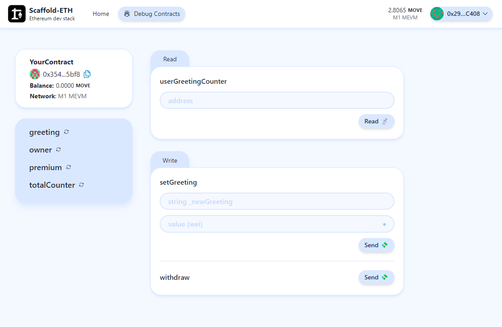

# Solidity dApp

In this guide for Solidity developers, you'll learn how easy it is to create an Aptos dApp React frontend and configure your dApp for Movement Network.

## Requirements

Make sure to have to have [Foundry](https://getfoundry.sh/) installed. If using Hardhat, have in mind that you will need to add custom chains.

## Setup

We will bootstrap our dapp the following with the command provided by Scaffold-ETH.

```bash
npx create-eth@latest
```

Once you have executed the npx create-eth@latest command in your terminal, follow the on-screen instructions to configure your Solidity dApp. You have the option to choose Foundry or Hardhat. We will use Foundry. Choose to install dependencies.

Navigate to your dApp's directory and launch your preferred Integrated Development Environment (IDE). In this guide, we will be using Visual Studio Code (VS Code).

```bash
cd your-dapp-name
code .
```

Within the project directory, you will encounter several folders and files. Our focus will primarily be on the following:

- `packages/foundry`
- `packages/nextjs`
## Deploying a Smart Contract with MEVM 

First, it will require some configuration. Navigate to packages/foundry/foundry.toml and change its content to the following:

```toml
[profile.default]
src = 'contracts'
out = 'out'
libs = ['lib']
fs_permissions = [{ access = "read-write", path = "./"}]

[rpc_endpoints]
mevm = "https://mevm.testnet.m1.movementlabs.xyz"
```

Next, in packages/foundry/.env add a private key to the variable DEPLOYER_PRIVATE_KEY. Make sure to fund it with MOVE from our Faucet.

Finally, remove YourContract's unwanted logging features.

```js
//SPDX-License-Identifier: MIT
pragma solidity >=0.8.0 <0.9.0;

// Use openzeppelin to inherit battle-tested implementations (ERC20, ERC721, etc)
// import "@openzeppelin/contracts/access/Ownable.sol";

/**
 * A smart contract that allows changing a state variable of the contract and tracking the changes
 * It also allows the owner to withdraw the Ether in the contract
 * @author BuidlGuidl
 */
contract YourContract {
    // State Variables
    address public immutable owner;
    string public greeting = "Building Unstoppable Apps!!!";
    bool public premium = false;
    uint256 public totalCounter = 0;
    mapping(address => uint256) public userGreetingCounter;

    // Events: a way to emit log statements from smart contract that can be listened to by external parties
    event GreetingChange(
        address indexed greetingSetter,
        string newGreeting,
        bool premium,
        uint256 value
    );

    // Constructor: Called once on contract deployment
    // Check packages/foundry/deploy/Deploy.s.sol
    constructor(address _owner) {
        owner = _owner;
    }

    // Modifier: used to define a set of rules that must be met before or after a function is executed
    // Check the withdraw() function
    modifier isOwner() {
        // msg.sender: predefined variable that represents address of the account that called the current function
        require(msg.sender == owner, "Not the Owner");
        _;
    }

    /**
     * Function that allows anyone to change the state variable "greeting" of the contract and increase the counters
     *
     * @param _newGreeting (string memory) - new greeting to save on the contract
     */
    function setGreeting(string memory _newGreeting) public payable {
        // Print data to the anvil chain console. Remove when deploying to a live network.

        greeting = _newGreeting;
        totalCounter += 1;
        userGreetingCounter[msg.sender] += 1;

        // msg.value: built-in global variable that represents the amount of ether sent with the transaction
        if (msg.value > 0) {
            premium = true;
        } else {
            premium = false;
        }

        // emit: keyword used to trigger an event
        emit GreetingChange(msg.sender, _newGreeting, msg.value > 0, 0);
    }

    /**
     * Function that allows the owner to withdraw all the Ether in the contract
     * The function can only be called by the owner of the contract as defined by the isOwner modifier
     */
    function withdraw() public isOwner {
        (bool success, ) = owner.call{value: address(this).balance}("");
        require(success, "Failed to send Ether");
    }

    /**
     * Function that allows the contract to receive ETH
     */
    receive() external payable {}
}

```

Now you can run the following command to deploy the prebuilt contract that comes with Scaffold-ETH:

```bash
yarn deploy --network mevm
```

It should give you a YourContract deployment address which should write to a file that Scaffold-ETH will take and use to generate a Front End for!


## Configure Your dApp for MEVM

Head to packages/nextjs/scaffold.config.ts and change targetNetworks to [chain.mevm]:

```ts
import * as chains from "viem/chains";
import { type Chain } from "viem"

export type ScaffoldConfig = {
  targetNetworks: readonly chains.Chain[];
  pollingInterval: number;
  alchemyApiKey: string;
  walletConnectProjectId: string;
  onlyLocalBurnerWallet: boolean;
  walletAutoConnect: boolean;
};

export const mevm = {
  id: 336,
  name: "M1 MEVM",
  network: "mevm",
  nativeCurrency: { name: "Move", symbol: "MOVE", decimals: 18 },
  rpcUrls: {
    default: {
      http: ["https://mevm.devnet.m1.movementlabs.xyz"],
    },
    public: {
      http: ["https://mevm.devnet.m1.movementlabs.xyz"],
    },
  },
  blockExplorers: {
    etherscan: { name: "Arbiscan", url: "https://explorer.mevm.devnet.m1.movementlabs.xyz" },
    default: { name: "Arbiscan", url: "https://explorer.mevm.devnet.m1.movementlabs.xyz" },
  },
  contracts: {
    multicall3: {
      address: "0xD67Eca381AAbd0c049554f5714E7d8C21864c560",
      blockCreated: 500,
    },
  },
} as const satisfies Chain


const scaffoldConfig = {
  targetNetworks: [mevm],
  pollingInterval: 30000,
  alchemyApiKey: process.env.NEXT_PUBLIC_ALCHEMY_API_KEY || "oKxs-03sij-U_N0iOlrSsZFr29-IqbuF",
  walletConnectProjectId: process.env.NEXT_PUBLIC_WALLET_CONNECT_PROJECT_ID || "3a8170812b534d0ff9d794f19a901d64",
  onlyLocalBurnerWallet: true,
  walletAutoConnect: true,
} as const satisfies ScaffoldConfig;
export default scaffoldConfig;
```

Sweet, you are pretty much setup. Now you can run the following to run your dApp:

``` bash
yarn start
```
Access your dApp at https://localhost:3000. Ensure MEVM is added to Metamask or your chosen EVM wallet to access all contract functions via http://localhost:3000/debug



Experiment with function calls and value queries.

## What dApps will you build on Movement?

Now you know how to configure a Solidity dApp for MEVM.
Check out YourContract logic, try a redeployment by tinkering with it. As a challenge, try modifying the Front End to display the user's greeting and counter!
We can't wait to see what dApps you build and deploy to Movement Network!