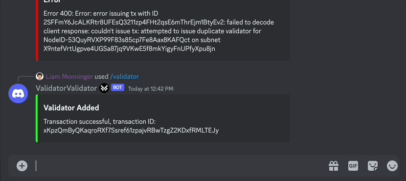

# Quick Start

The fastest way to get started as a Movement validator.

## Running a Suzuka Testnet Validator

### Becoming a Validator

:::note
Currently, we are running a permissioned testnet for Suzuka and individually selecting validators from our close associates.
:::

If you have been selected as one of our validators, ensure that you have been granted the `vals` role on our Discord. You will use this later to add your nodes to our validator set. 

Additionally, ensure your node ID is staked. The easiest way to do this is via Avalanche Core.

:::info
Without joining as a validator, you can still track our network, i.e., run a light client. 
:::

## Running a Node

### Infrastructure 

We recommend running on the following hardware:

- `>= 8 CPU (or vCPU)`
- `>= 16 GB RAM`
- `>= 128 GB Disk`

You will need to ensure your validator node has a public IP and that port 9651 is open to public TCP connections. 

Ensure also that your machine can appropriately fetch its IP with 

### Running Natively

Install the Movement CLI:
```bash
bash <(curl -fsSL https://raw.githubusercontent.com/movemntdev/M1/main/scripts/install.sh) --latest
```

Install the testnet artifacts:
```bash
movement manage install m1 testnet
```

Start the subnet service:
```bash
movement ctl start m1 testnet
```

### Running With Containers

Pull the `mvlbs/m1-testnet` Docker container:
```bash
docker pull mvlbs/m1-testnet:latest
```

Run the Fuji subnet service in the container foreground, e.g., as a CMD:
```bash
movement ctl start m1 testnet
```

## Adding Your Validator to the Validator Set

Ensure your node has bootstrapped on both the X and C chains:
```bash
curl -X POST --data '{
    "jsonrpc":"2.0",
    "id"     :1,
    "method" :"info.isBootstrapped",
    "params": {
        "chain":"X"
    }
}' -H 'content-type:application/json;' 127.0.0.1:9650/ext/info
```

Obtain your node ID:
```bash
curl -X POST --data '{
    "jsonrpc":"2.0",
    "id"     :1,
    "method" :"info.getNodeID"
}' -H 'content-type:application/json;' 127.0.0.1:9650/ext/info
```

If you have been granted the `vals` Discord role, you will be able to run the `/validator` bot with the following parameters to add your validator to the set:

- `node_id: [your-node-id]`
- `network_id: m1testnetv0`



Adding your validator by node ID on Discord:
You should then see that you are listed as a validator here: [Subnets Test](https://subnets-test.avax.network/subnets/X9ntefVrtUgpve4UGSa87jq9VKwE5f8mkYigyFnUPfyXpu8jn).

Without joining as a validator, you can still track our network, i.e., run a light client. 