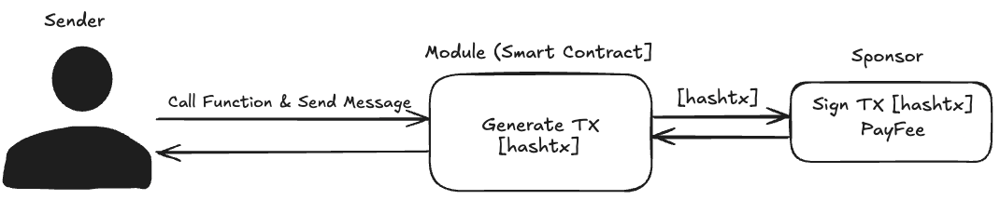

# Why we need Sponsored Transactions
> Sponsored transactions are essential on blockchain because they lower barriers to entry for new users by removing the need to hold native tokens for gas fees. This simplifies the user experience, enabling seamless onboarding for those unfamiliar with blockchain mechanics.
>
> By allowing applications or third parties to cover transaction fees, sponsored transactions foster mass adoption, enhance accessibility, and create opportunities for innovative use cases where end-users can focus on the value of the application without worrying about technical complexities

## How it works
1. The sender submits a transaction with a message using `RawTransaction`.
2. The transaction is sent to the pre-designated fee payer, who adds their signature and forwards it to the smart contract for execution.
3. When the transaction is executed, the fee payer's balance is deducted, while the sender does not need to hold native tokens `Move` to perform this function.



## Overview
Sponsored transactions enable one account (the fee payer) to cover the transaction fees for another account (the sender). This feature is particularly valuable for improving user experience by removing the requirement for new users to hold native tokens for gas fees.

## Prerequisites
- Aptos Wallet Adapter
- Aptos Client
- TypeScript environment

## Transaction Flow
1. Sender generates the transaction
2. Sender signs the transaction
3. Fee payer account is created and funded
4. Fee payer signs the transaction
5. Complete transaction is submitted to the network

## Implementation Steps

### 1️⃣ Setting Up Required Hooks and States

```typescript
const { connected, account, network, signTransaction, submitTransaction } = useWallet();
const [transactionToSubmit, setTransactionToSubmit] = useState<AnyRawTransaction | null>(null);
const [senderAuthenticator, setSenderAuthenticator] = useState<AccountAuthenticator>();
const [feepayerAuthenticator, setFeepayerAuthenticator] = useState<AccountAuthenticator>();
```

**Purpose:**
- `useWallet`: Provides wallet connection state and transaction signing capabilities
- `transactionToSubmit`: Stores the raw transaction to be processed
- `senderAuthenticator`: Stores the sender's signature
- `feepayerAuthenticator`: Stores the fee payer's signature

### 2️⃣ Generate Transaction (generateTransaction Function)

```typescript
const generateTransaction = async (): Promise<AnyRawTransaction> => {
  const transactionToSign = await aptosClient(network).transaction.build.simple({
    sender: account.address,
    withFeePayer: true,
    data: {
      function: "0x1::coin::transfer",
      typeArguments: [APTOS_COIN],
      functionArguments: [account.address, 1],
    },
  });
  return transactionToSign;
};
```

**Function Breakdown:**
- **Purpose**: Creates a raw transaction with fee payer support
- **Parameters**:
  - `sender`: The address initiating the transaction
  - `withFeePayer`: Enables sponsored transaction functionality
  - `data`: Transaction details including:
    - `function`: Smart contract function to call
    - `typeArguments`: Type of coin to transfer
    - `functionArguments`: Transaction parameters (recipient address and amount)

### 3️⃣ Sign Transaction (onSignTransaction Function)

```typescript
const onSignTransaction = async () => {
  const transaction = await generateTransaction();
  setTransactionToSubmit(transaction);
  try {
    const authenticator = await signTransaction(transaction);
    setSenderAuthenticator(authenticator);
  } catch (error) {
    console.error(error);
  }
};
```

**Function Breakdown:**
- **Purpose**: Gets sender's signature for the transaction
- **Steps**:
  1. Generates the transaction using `generateTransaction`
  2. Stores the transaction for later use
  3. Signs the transaction using the wallet adapter
  4. Stores the sender's signature (authenticator)

### 4️⃣ Create Sponsor Account and Sign as Fee Payer

```typescript
const SPONSOR_INITIAL_BALANCE = 100_000_000;
const sponsor = Account.generate();

const onSignTransactionAsSponsor = async () => {
  try {
    // Fund the sponsor account
    await aptosClient(network).fundAccount({
      accountAddress: sponsor.accountAddress,
      amount: SPONSOR_INITIAL_BALANCE,
    });

    // Sign transaction as fee payer
    const authenticator = await aptosClient(network).transaction.signAsFeePayer({
      signer: sponsor,
      transaction: transactionToSubmit,
    });
    setFeepayerAuthenticator(authenticator);
  } catch (error) {
    console.error(error);
  }
};
```

💡 **Function Breakdown:**
- **Purpose**: Creates and funds a sponsor account, then signs the transaction as fee payer
- **Steps**:
  1. Generates a new sponsor account
  2. Funds the sponsor account with initial balance
  3. Signs the transaction as fee payer
  4. Stores the fee payer's signature

### 5️⃣ Submit Transaction (onSubmitTransaction Function)

```typescript
const onSubmitTransaction = async () => {
  const response = await submitTransaction({
    transaction: transactionToSubmit,
    senderAuthenticator: senderAuthenticator,
    feePayerAuthenticator: feepayerAuthenticator,
  });
};
```

**Function Breakdown:**
- **Purpose**: Submits the fully signed transaction to the network
- **Parameters**:
  - `transaction`: The raw transaction to submit
  - `senderAuthenticator`: Sender's signature
  - `feePayerAuthenticator`: Fee payer's signature

## Important Notes
- The sponsor account must have sufficient balance to cover transaction fees
- Both sender and fee payer signatures are required for the transaction to be valid
- The `withFeePayer` flag must be set to true when generating the transaction
- Transaction amounts are specified in Octas (1 Octa = 10^-8 APT)
