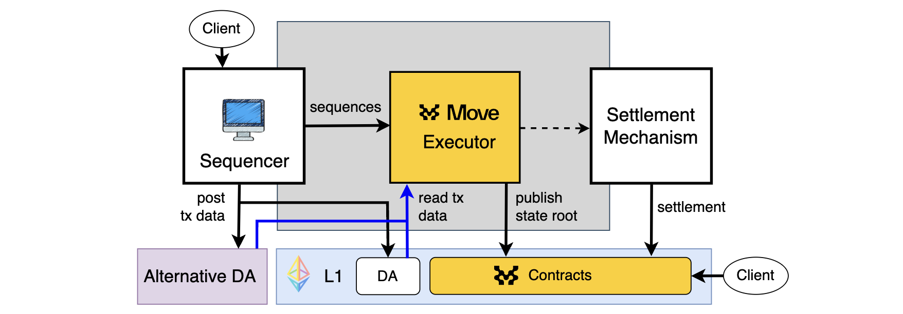

# Movement Frameworks

The Movement Network is built on robust frameworks that enable the creation, deployment, and management of Move-based chains. These frameworks include the Move Stack (which contains the Movement SDK) and the Move-based chain Framework, each designed to enhance performance, security, and interoperability.

## Move Stack

The Move Stack is a collection of tools, components, and adapters that enable the creation of customizable Move-based chains. It includes essential elements such as sequencing, data availability, and settlement mechanisms. The modular architecture of the Move Stack allows developers to select the most suitable components for their specific applications, ensuring optimal performance and security.

The Move Stack's configurable components include:

- **Sequencer**: Developers can opt for the default decentralized shared sequencing service or choose a self-reliant sequencing mechanism.
- **Data Availability**: Supports various DA solutions
- **Settlement Mechanisms**: Offers options for optimistic (fraud proof), ZK (validity proof) and staked (attestations) settlement mechanisms.

:::info
The Move Stack promotes standardization across critical infrastructure components, including wallet software, developer APIs, and block explorers. This standardization enhances interoperability and significantly improves the developer and user experience across the Movement Network ecosystem.
:::

## Movement Network

Movement Network provides a framework to deploy and join the Move-based chains network. It offers benefits such as Fast Finality Settlement, interoperability, and shared economic security. This framework supports a network of application-specific chains, enhancing interoperability and shared liquidity. It allows the deployment of specialized chains tailored to different use cases, such as DeFi, gaming, and supply chain applications.

:::info
The Movement Network supports the deployment of application-specific Move-based chains, providing cross-chain interoperability and shared liquidity. This setup enhances the efficiency and security of new chains by leveraging a decentralized sequencer and multi-asset staking.
:::

## Move Stack Chain: Framework for Move-based chains

The Move Stack Chain framework provides a blueprint for creating Move-based chains. It is a modular architecture where components can be configured to meet the specific needs of different applications. The framework includes key components such as the Move Executor, bridge contracts and adaptors for sequencing, a data availability, and a settlement. This flexibility allows for the customization of chains to optimize performance, cost, and security.

*Figure: The Move Stack Chain framework.*

### Key Components of the Move Stack Chain framework

- **Executor**: Processes transactions and generates new L2 blocks.
- **Bridge Contracts**: Facilitates asset deposits and withdrawals between L1 and the chain.
- **Sequencer**: Orders transactions.
- **Data Availability Service**: Ensures transaction data accessibility to the settlement mechanism.
- **Settlement Mechanism**: Verifies transaction execution correctness through various methods (e.g., ZK-proofs, fraud proofs, fast finality settlement).

:::info
The modularity of the Move-based chain framework allows developers to select different data availability solutions, settlement mechanisms, and sequencing options, customizing their chains to best fit their application's needs.
:::

## Transaction Lifecycle

Understanding the transaction lifecycle is crucial for understanding how Move-based chains achieve efficient and secure transaction finality. This lifecycle outlines the steps from the initial submission of a transaction to its final settlement, ensuring that every transaction is processed correctly and securely. The transaction lifecycle is also displayed in the [high-level architecture](../Mainnet/high_level_architecture.md) documentation.

The transaction lifecycle within a Move-based chain involves:

1. **Submission**:
A user submits a transaction to the Movement Network. After basic validation, the transaction is placed into the mempool, awaiting inclusion.

2. **Sequencing**:
An authorized [sequencer node](../Mainnet/node_level_architecture.md#sequencer-node) (Leader node) pulls transactions from the mempool and arranges them into transaction batches (ordering). From the ordering and the recorded batches, protoBlocks are formed, which will be executed during the execution step.

3. **Data Publication**:
The sequencer records the data and makes it publicly available so that the Movement Network can retrieve it. 

4. **Execution**:
Once protoBlocks are retrieved, a node executes the transactions using the Move VM. This updates the Movement Network state. The node then packages the executed protoBlocks into finalized Movement Blocks, including the new state root and other metadata.

5. **Settlement**:
Multiple Movement Blocks are periodically aggregated into a superBlock. The resulting state digest for the superBlock is written to an L1 contract as a Postconfirmation. Once settled, the Movement Network recognizes that state as finalized. Nodes read the settled confirmation from L1 to update their local state databases.
