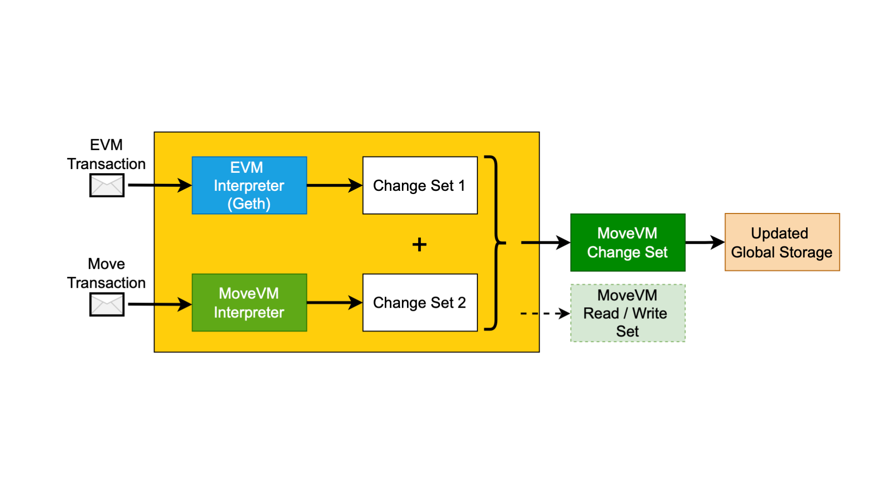

# Technical Details

The Movement Network has three main components that enhance its performance, security, and interoperability: the Move Executor, the Staked Settlement Module, and the Decentralized Shared Sequencer (M1). Each of these components plays a crucial role in ensuring the operation of Move-based rollups.

## Move Executor

The Move Executor is a core component of the Movement-SDK, supporting both MoveVM and EVM bytecode. This dual compatibility provides a robust execution environment, enabling developers to leverage the advanced features of the Move language while maintaining compatibility with existing Ethereum applications. The Move Executor integrates the parallel execution capabilities of MoveVM with existing EVM interpreters, ensuring compatibility and scalability.

## Fast Finality Settlement Module

The Fast Finality Settlement Module is designed to provide fast confirmations and settlement for transactions. By utilizing a network of validators who stake assets and attest to the correctness of state transitions, this module ensures crypto-econimic security and reduces latency. The validators combine the security benefits of staking with the efficiency of rapid transaction finality.

The Fast Finality Settlement includes Postconfirmations, see [this blog](https://blog.movementlabs.xyz/article/postconfirmations-L2s-rollups-blockchain-movement) (on-L1) and L2-confirmations (off-L1).

### Security Mechanism

- **Ethereum Settlement**: Validators stake assets to provide economic security, ensuring significant financial interest in network integrity.
- **zk and Optimistic Rollups**: zk-rollups offer security through validity proofs, while optimistic rollups rely on challenge periods for dispute resolution. Both methods have higher latency and computational costs.
- **Staked Rollups**: Offer fast finality and high economic security without extensive proof generation or challenge periods, reducing latency and improving user experience compared to zk and optimistic rollups.

### Comparison with Other Rollups

- Staked rollups do not require expensive proof generation equipment, unlike zk-rollups.
- Staked rollups provide significantly reduced latency compared to both optimistic and zk-rollups, with finality settlement in seconds.
- Fast finality is crucial for interoperability and atomic cross-rollup transactions, making staked rollups an ideal solution for many applications.

## Decentralized Shared Sequencer (M1)

The M1 sequencer is a decentralized and shared sequencing mechanism that enhances network robustness, fairness, and censorship resistance. By providing customizable transaction ordering, M1 supports cross-chain atomic swaps and pooled liquidity within the Move Arena ecosystem. This shared sequencer ensures fair and efficient transaction ordering across all participating rollups.

<!--  -->

:::info
The M1 sequencer not only improves network robustness but also facilitates cross-chain interoperability and pooled liquidity, allowing for seamless asset transfers and interactions across different rollups.
:::
