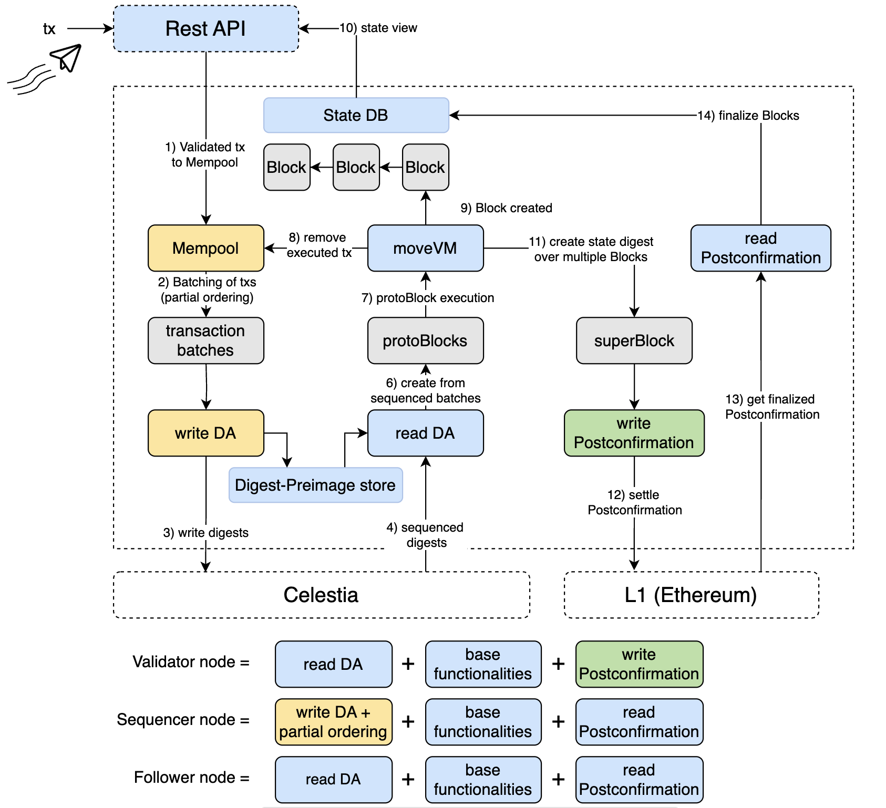

# High-level architecture



## Data Availability

The DA service is used to store transaction data and make it available to the network. The service is accessed via [DA light nodes](./node_level_architecture.md#da-light-node). The DA service is currently responsible for the following actions: 

- Forming Proto/Movement Network Blocks
- Signing these blocks
- Storing digests of the blocks and then posting the digests to Celestia
- Reading a blob stream of sequenced digests from Celestia
- Using the blob stream to lookup Proto Blocks
- Construct a Proto Block stream

## Sequencing

In order to protect the DA layer from spam, only certain [full nodes](./node_level_architecture.md#full-node) receive authorization to sequence transactions in ordered transaction-batches. These full nodes provide basic sequencing for transactions ingressed from the users. The full node then sends the transaction-batch to the DA service using the [DA light node](node_level_architecture.md#da-light-node).

The DA service sequences transaction batches (which have the form of data blobs).

The Movement Network DA service takes transaction batches and writes digests of the transaction batches to Celestia. Celestia is used in order to sequence the transaction digests.  

This results in proto-blocks, where each proto-block may contain several transaction batches.

The proto-block is the final ordering step of transactions. Next stop: execution.

## Execution

The [full node](./node_level_architecture.md#full-node) receives proto-blocks via the [DA light node](node_level_architecture.md#da-light-node) and executes the transactions in the proto-blocks. The full node then creates Movement Network blocks from the proto-blocks, which contain additional information such as the new state root after applying the transactions.

## Settlement

The network uses the [Fast Finality Settlement Module](../Introduction/technical_details.md#fast-finality-settlement-module) for transaction finality.

[Validator nodes](./node_level_architecture.md#validator-node) check against the [postconfirmed](../Introduction/technical_details.md#fast-finality-settlement-module) state root on L1 to increase their security and reduce the risk of providing wrong state updates to users. Initially - with the training wheels in place - a specialized node, called Core-Validator, is responsible for updating the state on L1.

As the training wheels are removed the network will move to a decentralized model where validators will be able to attest to the correctness of state transitions, and a supermajority of validators will be required to advance the state roots on L1.

At the moment the node will create state digests over multiple blocks resulting in a super-block. A post-confirmation is written to an [L! contract](https://etherscan.io/address/0x1bC3248fF599e1a71183a464058b01A78eC42edE). The node will then read the settled post-confirmation on the L! and make this available in the state DB. This will ultimately be viewable through the Movement Network REST API. 

## Fees

Transaction fees are paid in the token of the Movement Network. They are used to pay for the data availability, sequencing, execution, and settlement services:

```
fee = data_availability_fee + sequencing_fee + execution_fee + settlement_fee
```

For more information on fees, see [this MIP](https://github.com/movementlabsxyz/MIP/pull/19).
