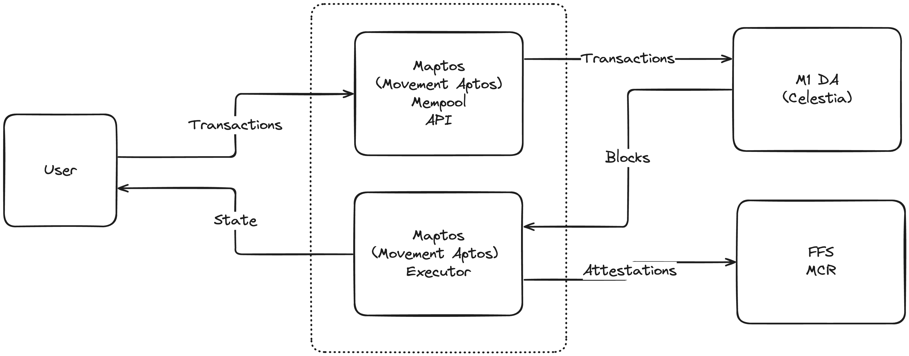

# High-level architecture

!!! . The node also gets informed from FFS about the finality status, hence the arrow should also go back.

!!! . where is the DA light node in this diagram? i assume the DA box is actually two boxes - one for the DA service and one for the DA light node.?

!!! . so Maptos  is the full node / validator node ?

!!! . where is the follower node in this diagram?

!!! . do we really send transactions 1-by-1 to the DA service? or do we send batches of transactions? if blobs, where are they created?

## Data Availability

The DA service is used to store transaction data and make it available to the network. The service is accessed via [DA light nodes](./node_level_architecture.md#da-light-node).

Celestia is used as the Data Availability (DA) layer.

!!! . do nodes pay fees to celestia? or is how is this rate limited?

## Sequencing

In order to protect the DA layer from spam, only certain [full nodes](./node_level_architecture.md#full-node) receive authorization to sequence transactions in ordered transaction-batches (called proto-blocks). These full nodes provide basic sequencing for transactions ingressed from the users. The full node then sends the proto-block to the DA service using the [DA light node](node_level_architecture.md#da-light-node).

The DA service sequences the proto-blocks and provides the final ordering of transactions to the network in L2-blocks.

## Settlement

The network uses the [Fast Finality Settlement Module](../Introduction/technical_details.md#fast-finality-settlement-module) for transaction finality.

[Validator nodes](./node_level_architecture.md#validator-node) and [full nodes](./node_level_architecture.md#full-node) check against the [postconfirmed](../Introduction/technical_details.md#fast-finality-settlement-module) state root on L1 to increase their security and reduce the risk of providing wrong state updates to users. Initially - with the training wheels in place - a specialized node, called Core-Validator, is responsible for updating the state on L1.

As the training wheels get removed the network will move to a more decentralized model where validators will be able to attest to the correctness of state transitions, and a supermajority of validators will be required to advance the state roots on L1.

## Bridge

!!! . TODO How does the bridge work? 

!!! . What is being bridged?

!!! . By whom?

!!! . Links to documentation?

!!! . A diagram or a flowchart?

!!! . TODO link to relevant node-section in the network-level architecture

## User interaction

!!! . TODO How do users interact with the network?
!!! . TODO Can they get confirmation by querying the validators?
