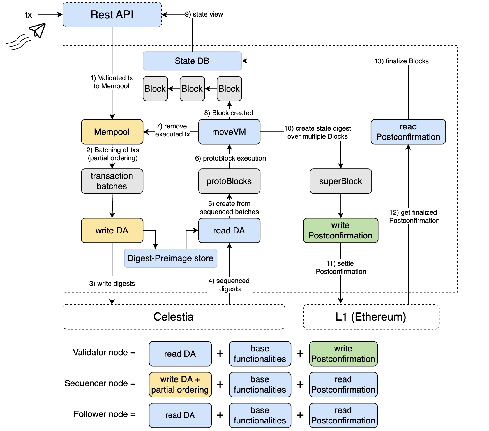

# High-level architecture



## Data Availability

The DA service is used to store transaction data and make it available to the network. The service is accessed via [DA light nodes](./node_level_architecture.md#da-light-node). The DA service is currently responsible for the following actions:

- Forming protoBlocks
- Signing these blocks
- Storing digests of the blocks and then posting the digests to Celestia
- Reading a blob stream of sequenced digests from Celestia
- Using the blob stream to lookup protoBlocks
- Construct a protoBlock stream

## Sequencing

In order to protect the DA layer from spam, only certain [sequencer nodes](./node_level_architecture.md#sequencer-node) receive authorization to sequence transactions into ordered transaction batches. These sequencer nodes provide basic sequencing for transactions ingressed from the users. The sequencer node sends the transaction batch digest to the DA service using the [DA light node](node_level_architecture.md#da-light-node).

The sequencer node takes transaction batches and writes digests of these to Celestia. Celestia is then used in order to sequence the transaction digests.

This results in protoBlocks, where each protoBlock may contain several transaction batches.

The protoBlock is the final ordering step of transactions. Next stop: execution.

## Execution

The [full node](./node_level_architecture.md#full-node) receives protoBlocks via the [DA light node](node_level_architecture.md#da-light-node) and executes the transactions in the protoBlocks. The full node then creates Movement blocks from the protoBlocks, which contain additional information such as the new state root after applying the transactions.

## Settlement

The network uses the [Fast Finality Settlement Module](../Introduction/technical_details.md#fast-finality-settlement-module) for transaction finality. [Validator nodes](./node_level_architecture.md#validator-node) are responsible for facilitating the Postconfirmation process. Initially a state digest is created over multiple blocks resulting in a superBlock. The Postconfirmation is written to an [L1 contract](https://etherscan.io/address/0x1bC3248fF599e1a71183a464058b01A78eC42edE).

Initially - with the training wheels in place - a specialized node, called Core-Validator, is responsible for updating the state on L1. As the training wheels are removed the network will move to a decentralized model where validators will be able to attest to the correctness of state transitions, and a supermajority of validators will be required to advance the state roots on L1.

Nodes check against the [postconfirmed](../Introduction/technical_details.md#fast-finality-settlement-module) state root on L1 to increase their security and reduce the risk of providing wrong state updates to users. In other words, they will read the settled Postconfirmation on the L1 and make this available in the state DB. This will ultimately be viewable through the Movement Network REST API.

## Fees

Transaction fees are paid in the token of the Movement Network. They are used to pay for the data availability, sequencing, execution, and settlement services:

```
fee = data_availability_fee + sequencing_fee + execution_fee + settlement_fee
```

For more information on fees, see [this MIP](https://github.com/movementlabsxyz/MIP/tree/gas-fee-calculation/MIP/mip-19).
