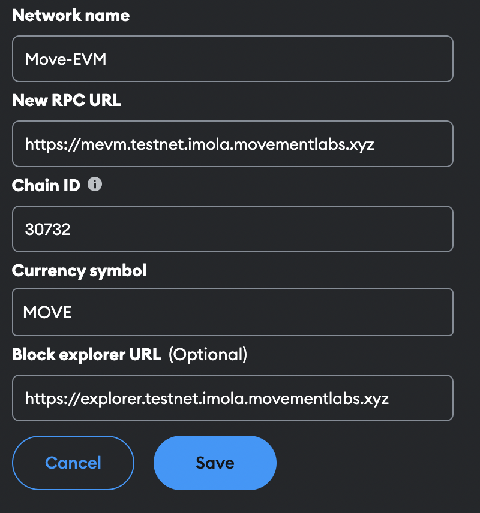

# Connect To Movement

Instruction for how to download and create a Web3 wallet for Movement and other Move and EVM chains.

If you would like to connect via CLI, refer to Movement CLI. Refer to Using Aptos CLI and Using Sui CLI if you are experienced with the respective ecosystems.

We currently have three environments for connecting to the Movement network:

- Suzuka Testnet (supports Aptos)
- Imola Testnet (supports EVM)
- Legacy Devnet (supports SUI)

## What is a Web3 Wallet?

A Web3 wallet facilitates blockchain interactions by managing your private and public keys, allowing for digital asset transactions and balance tracking. It's crucial to safeguard your private key; losing it means losing access to your funds. Always obtain your wallet from official or trusted sources.

## How to Connect to the Movement Network?

To build an RPC connection to the Movement Labs chains, you need to follow our standardized RPC format. It incorporates a few components, each representing different aspects of the connection settings. The general format for the URL is as follows:

`https://[language].[network].[blockchain].movementlabs.xyz`

Language: `aptos`, `sui`, `mevm`

## Aptos

:::info

Aptos Move is currently available on the Movement Suzuka Testnetwork

:::

With [petra](https://petra.app/)

- Name: `Movement_Testnetwork`
- Node URL: `https://aptos.testnet.suzuka.movementlabs.xyz/v1`

## Move EVM

Move-EVM (MEVM) is our framework enabled by Fractal our EVM transpiler for running EVM-compatible contracts and transactions. Wallets that support EVM with custom RPCs should be able to connect to MEVM.

:::info

MEVM is currently accessible from our Imola Testnetwork which is our EVM enabled environment

:::

With [Metamask](https://metamask.io/)

- Network Name: `Move-EVM`
- Devnet Network RPC: `https://mevm.testnet.imola.movementlabs.xyz`
- Network ID: `30732`
- Network Currency: `MOVE`
- Explorer: `https://explorer.testnet.imola.movementlabs.xyz`

## Sui 

Sui Move can be used with our legacy devnet. Wallets that support Sui with custom RPCs should be able to connect to this devnet. 

:::info

The Sui environment is currently accessible from the Sui Imola Testnetwork  

:::

With [Ethos](https://ethoswallet.xyz/)

Custom RPC URL: `https://sui.imola.testnet.movementlabs.xyz`

## How to Get Testnet Tokens?

To experiment with testnet tokens on the Movement Network, refer to our [Faucet](/general/UsingMovement/faucet) guide. This guide provides a straightforward process for acquiring testnet tokens to test transactions without real-world risks.