---

sidebar_position: 1

---

# Connect To Movement

This guide will show you how to use blockchains on the movement network. Everything from setting up the wallet to connecting to the chain, getting testnet tokens from the faucet, and using the explorer will be covered in this guide.

Let’s start by installing a wallet. We recommend using Razor and Nightly, which work on Chrome, Brave, Opera, Edge, and other Chromium-based browsers.

Install the Chrome extension for Razor from this [link](https://chromewebstore.google.com/detail/razor-wallet/fdcnegogpncmfejlfnffnofpngdiejii) and Nightly [here](https://chromewebstore.google.com/detail/nightly/fiikommddbeccaoicoejoniammnalkfa).

Make sure to pin your wallet in the extension tab on the top right

## Wallet Setup

 Follow the instructions to set up the wallet. 

### Razor

**Step 1: Welcome to Razor Wallet**

1. Open the Razor Wallet application or extension.
2. You will be greeted with the welcome screen.
3. Read and agree to the Terms of Service by checking the box.
4. Click on the “Start” button.

**Step 2: Secret Recovery Phrase**

1. The next screen will present you with your Secret Recovery Phrase. This is a critical step in setting up your wallet. Click on “Create a new wallet”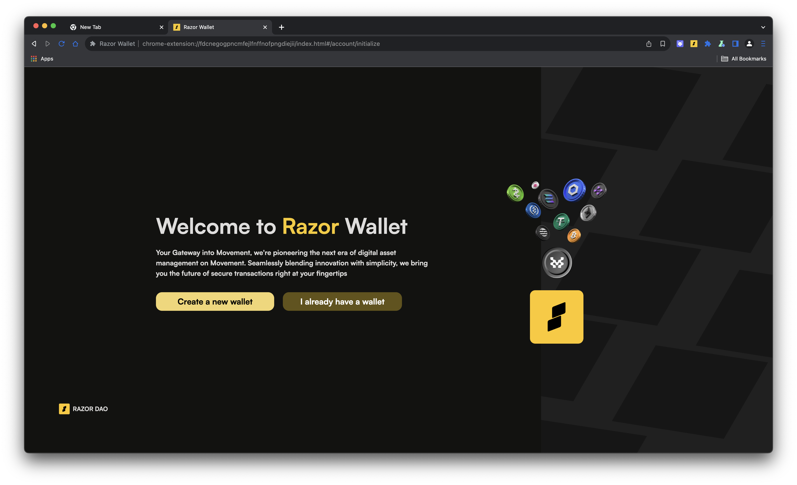
2. Ensure you write down the 12-word phrase and store it securely. Do not share it with anyone.
3. Click on “I have saved my secret phrase” after you have safely noted it down.

**Step 3: Create a Password**

1. You will now be prompted to create a password for your Razor wallet.
2. Enter a strong password and confirm it by entering it again.
3. Click on the “Proceed” button.

**Step 4: Welcome to Razor Wallet Dashboard**

1. After setting up your password, you will see the Razor Wallet dashboard upon clicking the extension.

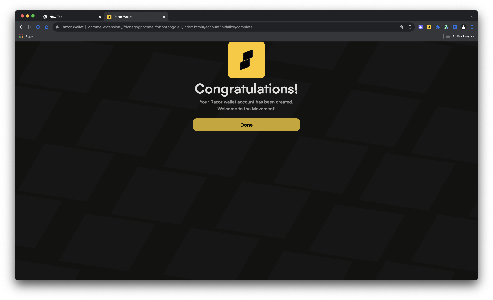  

### Nightly

**Step 1: Welcome to Nightly Wallet**

1. Open the Nightly Wallet application or extension.
2. You will be greeted with the welcome screen.
3. Click on the “Start your journey with Nightly!” button.

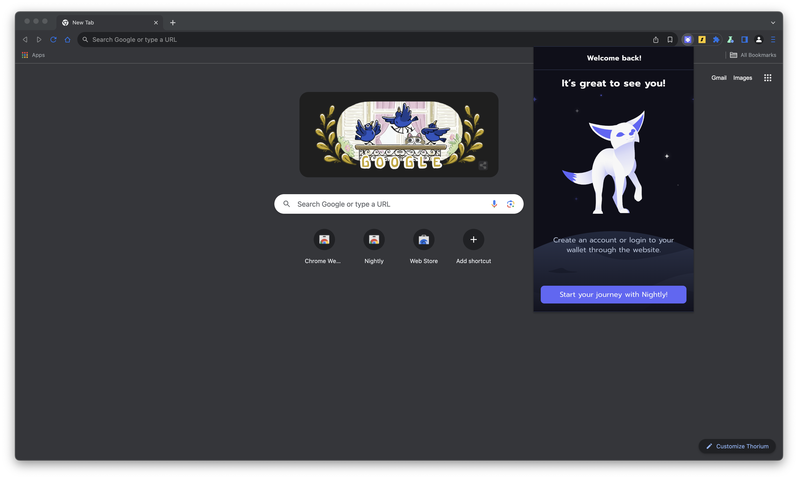  

**Step 2: Set Password**

1. You will now be prompted to create a password for your Nightly wallet after you create a new wallet.
2. Enter a strong password and confirm it by entering it again.
3. Click on the “Next” button.

  

**Step 3: Your Secret Phrase**

1. The next screen will present you with your Secret Recovery Phrase. This is a critical step in setting up your wallet.
2. Ensure you write down the 12-word phrase and store it securely. Do not share it with anyone.
3. Click on “Next” after you have safely noted it down.

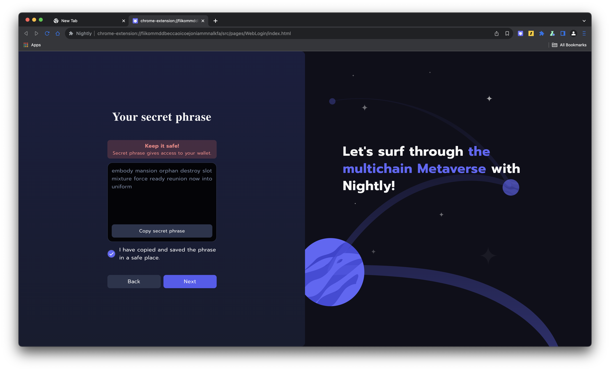  

**Step 4: Wallet Created**

1. Once you have completed the setup, you will receive a message indicating that your Nightly wallet has been created.
2. Click on “Log in to your wallet” to finish the setup process.

  

**Step 5: Nightly Wallet Dashboard**

1. After logging in, you will see the Nightly Wallet dashboard.
2. Be sure to select Movement from the network drop-down menu and you’re set!

## Importing an Account

If you have an account on Razor and would like to import it to Nightly, follow these steps:

**Step 1: Retrieve Private Key from Razor Wallet**

1. Open the Razor Wallet extension.
2. Click on the settings icon to open the settings menu.

  

3. Select “Wallet” to manage your account.

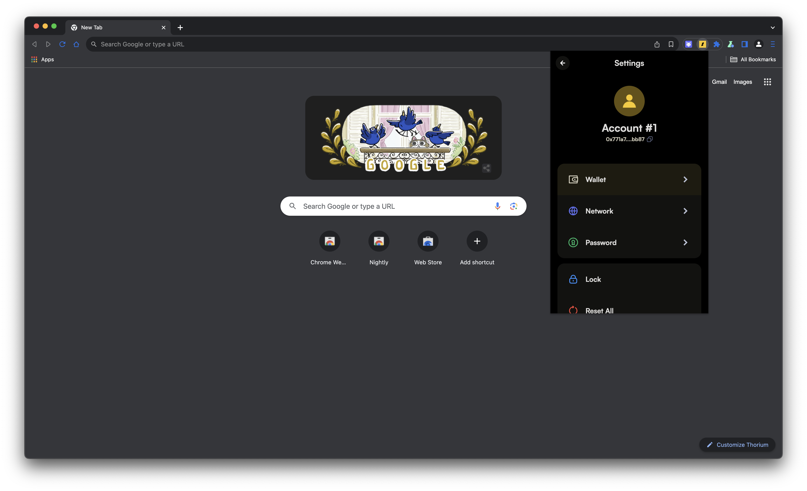  

4. Click on “View private key” to retrieve your private key.

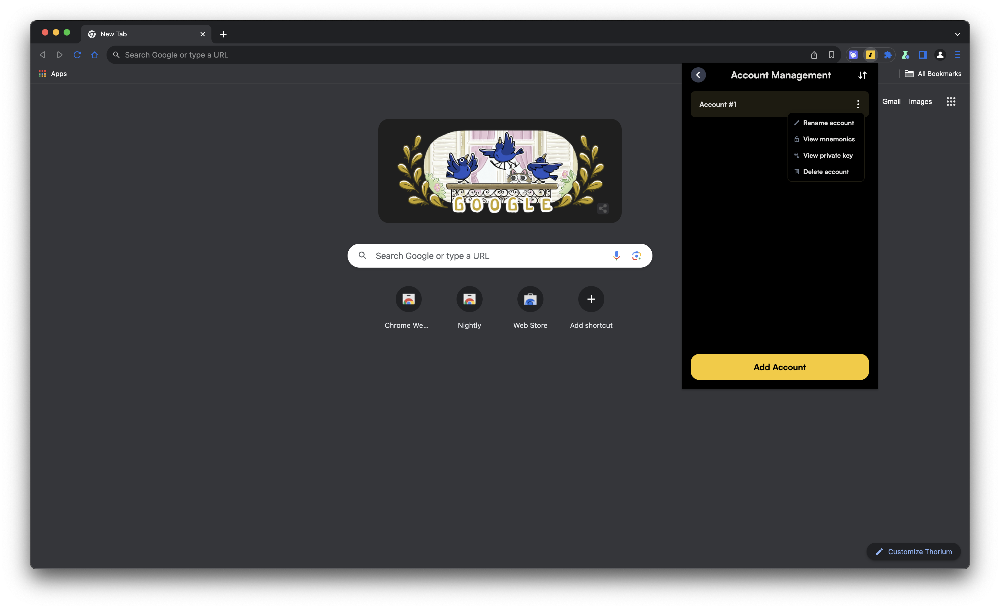  

5. Enter your Razor Wallet password to view the private key.

  

6. Copy the private key shown on the screen.

  

**Step 2: Import Private Key into Nightly Wallet**

1. Open the Nightly Wallet extension.

  

2. Click on the hamburger menu icon to open the menu.

  

3. Select “Wallet” and click on “Import private key.”

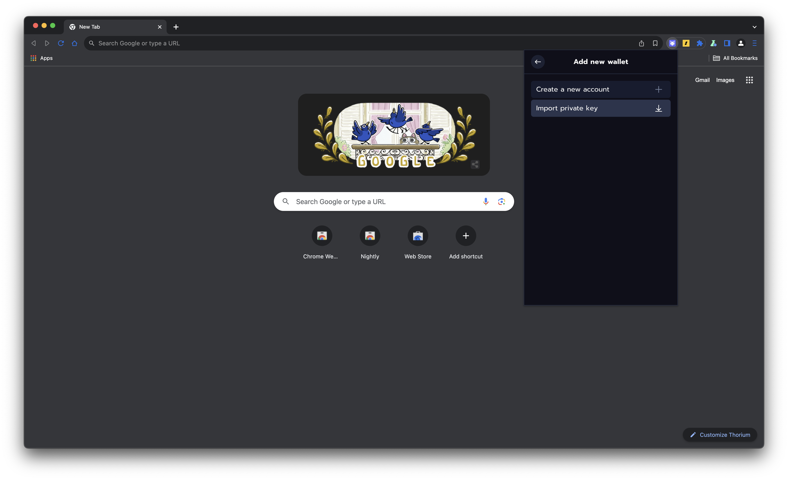  

4. Paste the private key you copied from the Razor Wallet.
5. Click “Import” to add your Razor account to Nightly Wallet.

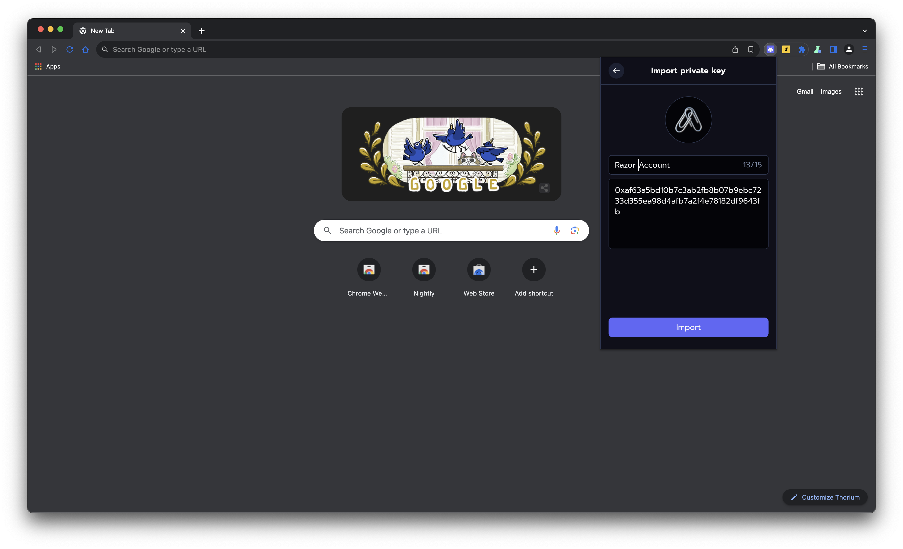

## Connecting to the Movement Network

There are three chains live on the Movement:

1. Aptos Move
2. Sui Move
3. Move EVM (MEVM)

Aptos Move is in Testnet and Devnet, while Sui Move and Move EVM (MEVM) are in Devnet only.

dApps deployed across these chains will work on both Razor and Nightly wallets.

Let’s try and use them on Movement’s Faucet, for example, on MEVM.

**Step 1: Access the Movement Faucet**

1. Open your browser and go to [Movement Faucet](https://faucet.movementlabs.xyz/).
2. Select the chain you want to use. For this example, select “MEVM” in the mock tokens section.

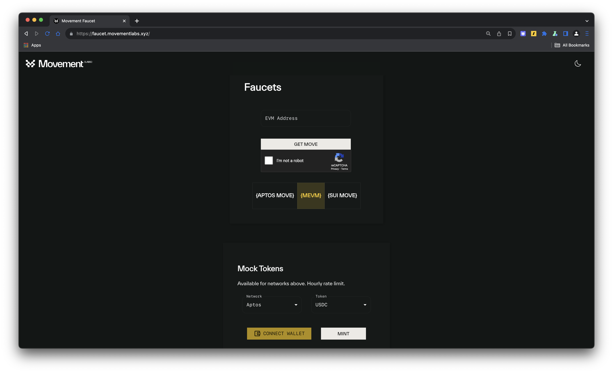  

**Step 2: Connect Your Wallet**

1. Click on the “Connect Wallet” button.
2. Choose either Razor Wallet or Nightly Wallet from the list of available wallets.

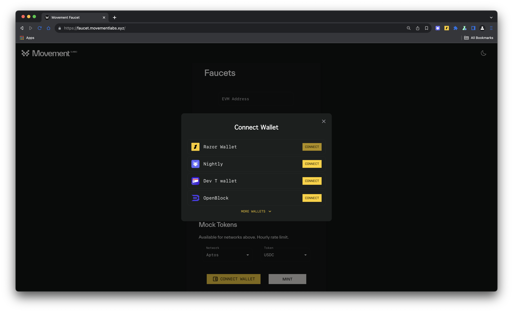

**Step 3: Approve Access Request**

1. Your wallet will request access to connect to the Movement Faucet.
2. Approve the access request by clicking “Confirm”.

**Step 4: Get Mock Tokens**

1. Now that the wallet is connected, you can mint dummy tokens as per your needs.

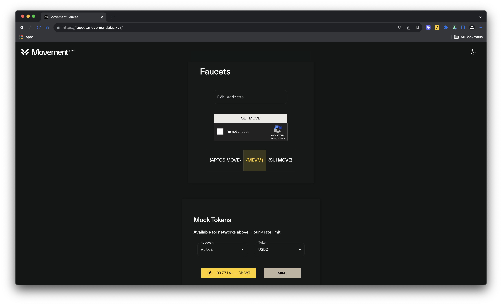

Using this faucet, you can get testnet tokens across any movement chain.

That is it for this guide! If you’re looking to build on Movement, check out our docs and head over to [Battle of Olympus](https://olympus.movementlabs.xyz/).