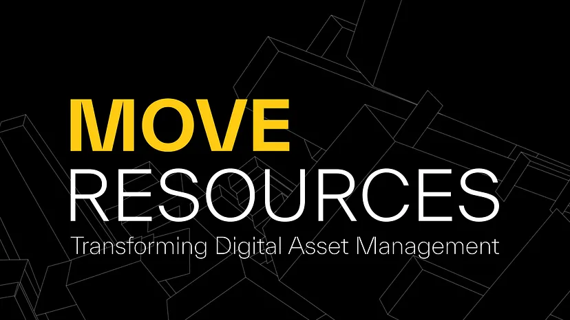

# Move Resources

Read the original article [here](https://medium.com/movementlabsxyz/transforming-digital-asset-management-the-move-revolution-b55563001885)

The digital landscape continuously evolves, with digital assets increasingly at the center of technology and finance. Amid change, managing and securing these assets have become critical challenges. Traditional systems often face issues such as duplication, unauthorized access, and tampering. Move, a programming language, is changing this scenario, offering a new resource model to redefine digital asset management.

## The Ethereum Virtual Machine Approach to Asset Management

The Ethereum Virtual Machine (EVM) has become a standard in the blockchain industry. Its approach to managing digital assets involves centralized asset logic, mutable states, and dynamic asset control. This framework supports a wide range of decentralized applications (DApps), leveraging Ethereum's smart contract platform's unique capabilities.

Core elements of the EVM's approach include:

- **Centralized Asset Logic**: Smart contracts consolidate rules and behaviors of digital assets into centralized reference points. This design choice enhances efficiency and simplicity in deployment and asset management but also necessitates advanced security measures to protect against attacks.

- **Mutable States**: EVM allows for changeable states within its smart contracts. While the adaptability enhances the utility and responsiveness of DApps, it also increases the need for heightened security to prevent unauthorized changes.

- **Dynamic Asset Control**: Enabled via state variables in smart contracts, dynamic asset control allows flexible and adaptive asset management. But it also requires careful balance between security and adaptability to safeguard against unauthorized manipulation.

Despite its innovations, challenges exist in managing these digital assets in the EVM, impacting the security, integrity, and trustworthiness of assets.

## EVM's Challenges

Some EVM challenges include:

1. **Lack of Ownership Enforcement**: The EVM framework lacks intrinsic mechanisms to enforce asset ownership and identify assets uniquely, leading to potential security problems such as disputes over ownership and unauthorized asset use.

2. **Copy and Drop Risks**: The EVM's flexibility in managing digital assets is accompanied by risks of assets being copied, dropped, or discarded without safety measures. This is a threat to the reliability of the blockchain and user trust, particularly for non-fungible tokens (NFTs).

3. **Unauthorized Changes to Mutable Resources**: Resources or assets that can be altered without proper authorization present a security vulnerability. Unauthorized alterations could manipulate asset attributes or balances, affecting their value and the security of the blockchain platform.

## Move's Resource Model

In contrast, Move uses a resource-centric approach to digital asset management. It focuses on safety, security, and explicit resource ownership. Each asset always has a single, unambiguous owner. Security issues associated with EVM's centralized logic and mutable states are mitigated by embedding strict ownership and immutability rules directly into the Move language.

Two foundational pillars of Move's model are linear ownership and immutable resources:

- **Linear Ownership**: Each digital asset is attributed to a single, definitive owner at a time, addressing and mitigating risks associated with asset duplication and unauthorized copying.

- **Immutability** : Once an asset is deployed, its state cannot be altered. This ensures the consistency of every asset and transaction within the ecosystem and prevents unauthorized asset modifications.

## Understanding Move's Resources

In Move, resources are specific types of structs defined as non-copyable and need explicit transfer between accounts. These resources follow strict type safety and access control mechanisms enforced by Move's virtual machine. This design ensures every manipulation of resources adheres to secure, predefined protocols. For example, resources are implemented as structs with abilities like key and store, enhancing asset security and control.

## Abilities in Move

Move introduces four primary abilities: key, store, drop, and copy. These abilities provide a robust framework for managing resources securely and efficiently. For example:

- **Key Ability**: Establishes clear and secure ownership of assets. Each asset, marked with the key ability, is tied to a unique identifier, ensuring ownership is unambiguous and verifiable at any time.

- **Store Ability**: Enables resources to be securely stored in the global state of the blockchain.

- **Copy Ability**: Useful for creating multiple references to the same resource without losing its uniqueness.

- **Drop Ability**: Allows resources to be discarded or destroyed, managing the lifecycle of resources.

## Applying Move's Abilities in Practice

The BasicCoin module in Move is an illustrative example of Move's asset management capabilities. It demonstrates how digital assets can be created, managed, and securely stored with unprecedented levels of security and efficiency. Furthermore, Movement Labs' involvement signifies a leap forward in bridging Ethereum's capabilities with the precision of Move's asset management, leveraging the strengths of both ecosystems.

## Conclusion

Move's resource model and abilities represent a significant evolution in blockchain asset management. This innovative approach enhances the security and efficiency of transactions, fostering a reliable digital asset ecosystem. As we navigate the complexities of the digital world, Move's contributions lay a solid foundation for the future of blockchain technology, promising a secure, transparent, and efficient universe for digital asset management.