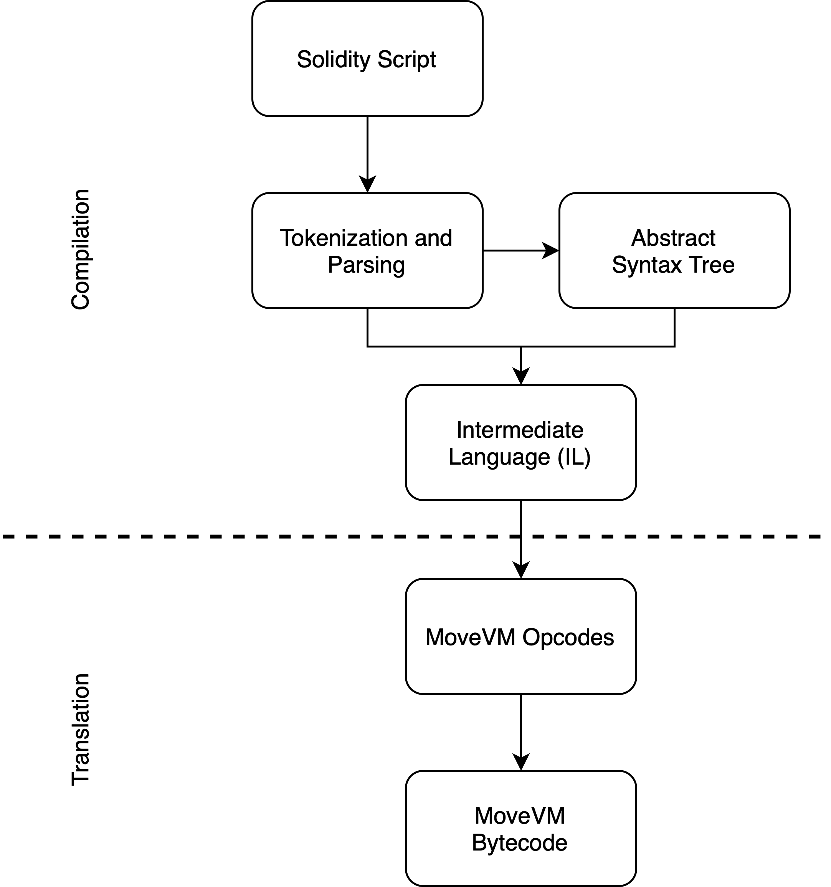

# Movement SDK

## Introduction

The Movement SDK is an innovative tool that combines the advantages of MoveVM and Solidity to redefine blockchain integration. By combining the secure architecture of MoveVM with the adaptability of Solidity, this toolkit supports a new era of managing, securing, and transacting digital assets across various blockchain platforms. In this document, we will explore the basic workings and potential impact of the Movement SDK in shaping blockchain technology's future.

## Detailed Look at the Movement SDK

The Movement SDK is a bridge that allows for modularity and interoperability between blockchain environments. It connects the Ethereum and Move ecosystems, offering a flexible and efficient platform for deploying blockchain applications inside a MoveVM execution environment as part of the M2 framework. It also synchronized with M1, a decentralized network of sequencers, offering a scalable and efficient blockchain infrastructure.

Core Components

1. **MoveVM**: server as a secure engine for running smart contracts unto Move's safety and efficiency principle.

2. **Fractal**: a bridge for Solidity that allows developers to deploy existing Solidity contracts on MoveVM.

3. **Custom Adaptors for Sequencer Networks and DA Services**: these facilitators enable seamless integration with sequencer networks and data availability layers.

With these components, the Movement SDK revolutionizes the M2 framework and drives innovation in the blockchain space.

## The Secure Execution Engine: MoveVM

MoveVM is fundamental to the Movement SDK. It is a resource-oriented computing paradigm that changes how digital assets are handled within the blockchain ecosystem. It ensures high security, integrity, minimal vulnerabilities, and efficient asset management.

Key Features

1. Resource-Oriented Programming
2. Strong Safety Guarantees
3. Efficient Asset Management
4. Type Safety and Formal Verification
5. Isolation and Encapsulation
6. Bytecode Verification

Through MoveVM, the Movement SDK offers a blend of security, functionality, and enhanced Ethereum platform capabilities.

## Fractal: Bridging Solidity and MoveVM

Fractal is critical in the Movement SDK as it translates Solidity smart contracts into a language MoveVM can execute.

The Translation Process

1. Tokenization and Parsing
2. Abstract Syntax Tree (AST)
3. Intermediate Language (IL)
4. MoveVM Opcodes
5. MoveVM Bytecode

Fractal empowers Ethereum developers to move their contracts to the M2 platform, allowing for the use of MoveVM's robust features while maintaining the original Solidity logic.

## Custom Adaptors for Seamless Integration

The Movement SDK's custom adaptors ensure secure connection with various blockchain networks and services.

Functions Include

1. Validator Set Management
2. Interfacing with Sequencer Networks
3. Enhancing Data Availability
4. Facilitating M2's Rollup-Centric Roadmap

These adaptors are crucial for maintaining the blockchain's adaptability, scalability, and efficiency.

## Conclusion

The Movement SDK is a vital step in the evolution of blockchain, combining the benefits of MoveVM and Solidity. It sets a benchmark for smooth integration, allowing smart contracts and assets to leverage better security and performance. The SDK is adaptable to various data availability layers and consensus mechanisms, becoming a foundation for an innovative blockchain infrastructure.

This introduction of the Movement SDK into the industry marks a new era of possibilities and the full potential of the blockchain expected to be uncovered and expanded further.