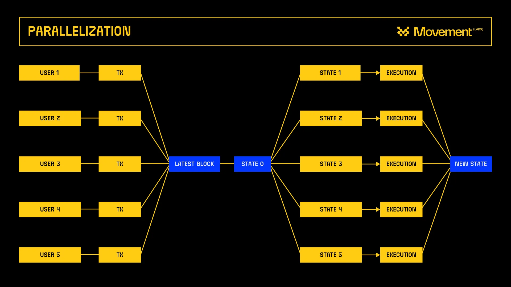
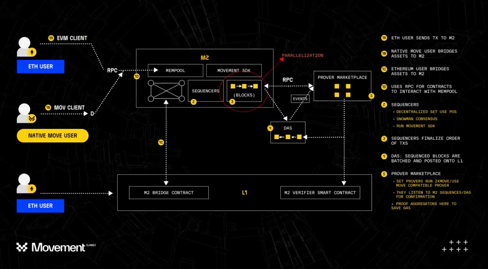
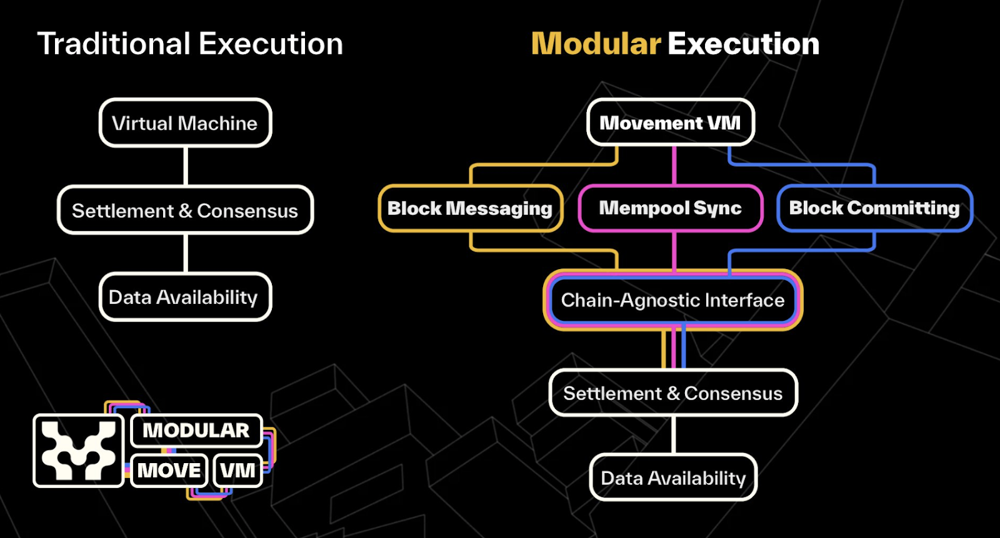

# Parallelization

Read the original article [here](https://medium.com/movementlabsxyz/parallelization-a-fresh-perspective-on-blockchain-transactions-4d6c265ec57f)

## A Fresh Perspective on Blockchain Transactions

Parallel processing in blockchain technology marks a transition from conventional sequential processing to a concurrent model. This transition leverages modern multi-core processors to increase transaction speed and energy efficiency within the network by allowing multiple transactions to be processed simultaneously.

## The Downside of Sequential Processing

Many blockchain networks, such as Ethereum, use a sequential processing model. The model processes transactions in the order they're received, which has become a bottleneck for the network's efficiency and scalability.

Main drawbacks of sequential processing:

1. **Limited System Throughput**: Reduces the network's ability to manage growing activity.
2. **Increased Congestion and Delays**: Contributes to network congestion and significant transaction delays.
3. **Rising Transaction Fees**: Triggers competitive bidding for transaction prioritization, raising gas fees.
4. **Scalability Constraints**: Worsens scalability issues during periods of peak transaction volume.

Sequential processing restricts system throughput as blockchain usage intensifies due to a surge in usage of decentralized finance (DeFi) applications, non-fungible tokens (NFTs), and complex smart contracts. This results in a congestion that leads to longer wait times and diminished user experience. Furthermore, high demand for immediate processing leads users to offer higher gas fees for prioritization, thus inflating processing costs and undermining equal access.

## Sequential Processing: The Bottleneck

Sequential processing creates a bottleneck effect on blockchain networks. This model can process transactions only as fast as the slowest link allows, which results in delayed transactions and often exorbitantly high transaction fees. As blockchain aims to function as foundational technology requiring real-time processing, this system is unsustainable, hindering widespread adoption for high-volume applications.

## Overcoming Blockchain's Sequential Hurdles: The Path to Efficiency and Scalability

The underlying technical architecture in many blockchain networks (like Ethereum) generally underutilizes computational resources available in modern hardware. Current paradigms don't utilize the parallel processing capabilities of multi-core environments, which leads to substantial inefficiency in energy usage and computational power.

Additionally, the Ethereum Virtual Machine (EVM) mempools, transaction holding areas, can become bottlenecks during high network activity, leading to unpredictable delays and a higher risk of manipulation through transaction prioritization and higher fees.

## Parallel Execution: The Road to Efficiency

Parallel execution introduces a new phase in blockchain technology. This new model offers transactions across multiple nodes, allowing simultaneous processing. This significantly enhances transaction throughput and overcomes the scalability issues from earlier models.

Platforms like Sui and Aptos have implemented distinct methods of parallel execution, each designed to optimize network performance and scalability. Sui adopts an object-centric approach, segmenting the blockchain's state into discrete objects that can be operated independently and in parallel. Conversely, Aptos introduces a revolutionary consensus mechanism alongside its parallel execution engine, Block-STM (Software Transactional Memory), to facilitate concurrent transactions while maintaining the ACID properties.

## The Future Is Parallel: Pioneering a New Blockchain Epoch

The advent of parallel execution and platforms like MoveVM pioneer a new era in blockchain technology. This revolution addresses problems of transaction speed, network scalability, and energy inefficiency, paving the way for a more versatile and sustainable blockchain ecosystem.

## The Advantages of Parallelization Across Blockchain Networks

Parallel execution enriches the blockchain landscape and offers a suite of improvements that address longstanding problems including:

- Eased Network Congestion
- Optimized Hardware Utilization
- Enhanced Scalability & Speed
- Improved System Integrity

## Navigating Parallelization's Challenges

Parallel processing introduces specific challenges that need careful management, including:

- Potential for Ledger inconsistencies
- Need for Sophisticated Coordination
- Computational Resource Demands

To meet these challenges, sophisticated solutions are required to maintain ledger integrity while ensuring computational resources remain efficient.

## Movement Labs' Strategic Solutions

At Movement Labs, we're enhancing MoveVM with innovative features designed to mitigate potential risks associated with parallel processing. Our approach includes a robust conflict resolution protocol and the application of artificial intelligence to optimize the transaction validation process.

## Introducing MoveVM by Movement Labs: A Leap Towards Scalability

MoveVM by Movement Labs is designed to directly address the inherent challenges of parallel execution in blockchain technology. Its key features include Mempool Sync, Block Building, and Block Committing, to ensure unparalleled efficiency and scalability across various blockchain networks and ecosystems.

## Conclusion: A Paradigm Shift in Blockchain Technology

The transition towards parallel processing represents a significant milestone in the further development of blockchain technology. Through parallel processing and the enhancements to MoveVM, we're stepping towards a future where blockchain's capabilities can be fully realized. This new era promises a blockchain ecosystem that's scalable, efficient, and interconnected, fostering an environment ripe for innovation and widespread adoption.